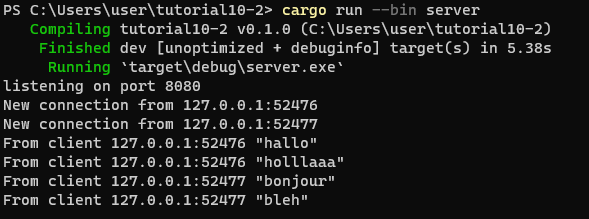
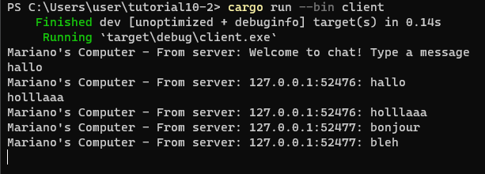
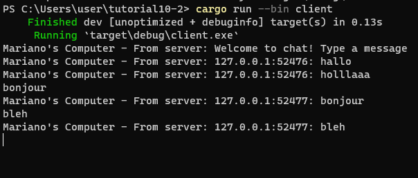

## 2.1

server:
    

client 1:
    

client 2:
    

client 3:
    

Pada server dapat dilihat setiap kali ada client yang jalan dan connect ke server. Setiap kali client mengirimkan pesan akan terlihat di server ip client yang mengirimkan pesan dan pesannya. Selain itu server juga akan mengirimkan kembali pesan yang dikirimkan oleh client tersebut ke semua client yang connect ke server.

## 2.2

Pada client menggunakan websocket, tapi pada server menggunakan TCP. TCP sendiri adalah dasar dari websocket.

## 2.3

server:
    

client 1:
    

client 2:
    

Pada server.rs dimodifikasi bagian untuk mengembalikan pesan kepada client menjadi : 
    let message = format!("{addr}: {text}");
    bcast_tx.send(message.into())?;
Yang sebelumnya hanya isi pesan saja yaitu text, sekarang ditambahkan dengan ip client yaitu addr. 
