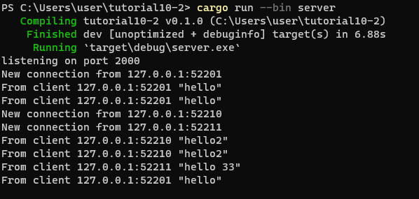
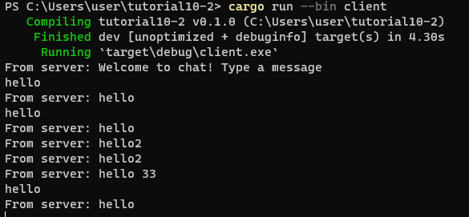
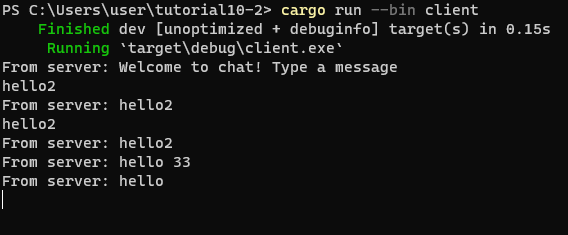
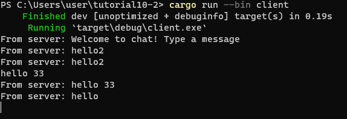

server:

client 1:

client 2:

client 3:

Pada server dapat dilihat setiap kali ada client yang jalan dan connect ke server. Setiap kali client mengirimkan pesan akan terlihat di server ip client yang mengirimkan pesan dan pesannya. Selain itu server juga akan mengirimkan kembali pesan yang dikirimkan oleh client tersebut ke semua client yang connect ke server.
